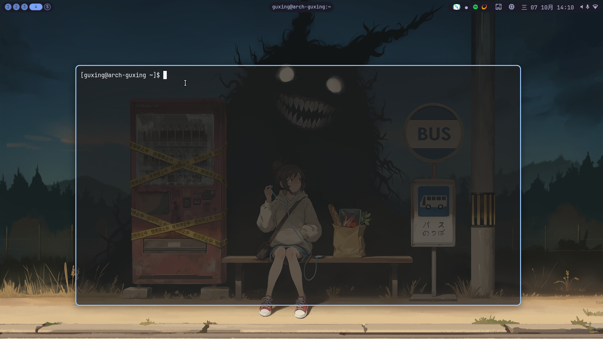

# niri-desktop

arch-guxing 的 niri 桌面配置快照。本仓库只归档配置，不自动安装、不影响当前会话，也未上传远端。

## 桌面预览



## 当前方案

- niri 26.04；主修饰键 Alt。
- 窗口间距 12px、圆角 10px、柔和阴影。
- Chrome 固定 opacity 0.97；其他窗口 active 0.98 / inactive 0.85。
- foot 背景 alpha 0.7；会与合成器窗口透明度叠加。
- 原生 Apple-inspired 动画：打开 180ms、关闭 140ms；横向滚动、窗口移动与缩放统一弹簧参数。并非 macOS 精确复刻。
- ashell 顶栏：工作区、窗口标题、托盘、换壁纸、系统信息等。
- swww：每 30 分钟随机壁纸、1 秒淡入淡出；锁屏时暂停换图。
- hyprlock 使用当前壁纸；hypridle 空闲 10 分钟熄屏。
- 莫奈取色、自定义动画 shader 尚未实现。

## 文件布局

```text
config/niri/config.kdl
config/ashell/config.toml
config/foot/foot.ini
config/fuzzel/fuzzel.ini
config/mako/config
config/hypr/{hyprlock.conf,hypridle.conf}
scripts/{niri-wallpaper,niri-wallpaper-next,niri-system-info,niri-memcheck}
```

不包含壁纸、Sunshine 凭据/配对状态、输入法用户数据、缓存、运行状态、历史备份或程序二进制。

## 依赖

niri、ashell、foot、fuzzel、mako、swww（含 swww-daemon）、hyprlock、hypridle、fcitx5、xwayland-satellite，以及 PipeWire/WirePlumber（wpctl）、polkit-gnome。

字体：JetBrainsMono Nerd Font Mono、Noto Sans CJK SC；光标：Bibata-Modern-Ice；图标：Adwaita。

脚本还用到 bash、util-linux（flock）、procps-ng（top/pgrep）、findutils 和常规 GNU 工具。辅助二进制不打包；优先使用发行版包或官方预编译 release。

## 迁移前必须检查

这是当前机器的配置快照，不是通用安装器：

1. `/home/guxing` 是硬编码路径，换用户后需替换配置和脚本中的路径。
2. 壁纸目录是 `~/图片/壁纸`，自行准备图片。`~/.local/state/niri-wallpaper/current` 链接由脚本生成，不入库。
3. niri environment 中有本机代理 `127.0.0.1:7890` 和 NVIDIA 环境变量；按目标机器调整。代理不可用时应移除对应代理变量。
4. fcitx5 配置/词库未归档，目标机器需要自行安装和配置中文输入法。
5. `Alt+Y` 仍是历史 waytray 快捷键，daemon 已不再自启，迁移时建议移除或重新配置。
6. 脚本 niri-memcheck 的 PSS 只包含可读的进程内存，不包含内核内存；末尾原有“含内核”提示不准确。普通用户无法读取所有进程，所以不要当成全系统精确总账。

## 手动恢复

先安装依赖并处理上面的本机路径/代理差异。以下命令会覆盖目标配置，先做好备份：

```bash
cd ~/e/niri-desktop
backup="$HOME/.local/state/niri-desktop-backups/$(date +%Y%m%d-%H%M%S)"
mkdir -p "$backup" "$HOME/.config" "$HOME/.local/bin"
for name in niri ashell foot fuzzel mako hypr; do
    if [ -e "$HOME/.config/$name" ]; then
        cp -a "$HOME/.config/$name" "$backup/"
    fi
done
for name in niri-wallpaper niri-wallpaper-next niri-system-info; do
    if [ -e "$HOME/.local/bin/$name" ]; then
        cp -a "$HOME/.local/bin/$name" "$backup/"
    fi
done
cp -a config/. "$HOME/.config/"
install -m 755 scripts/niri-wallpaper scripts/niri-wallpaper-next scripts/niri-system-info "$HOME/.local/bin/"
# memcheck 放在会话 PATH 中；先确认目标文件没有需保留的修改
sudo install -m 755 scripts/niri-memcheck /usr/local/bin/niri-memcheck
niri validate -c "$HOME/.config/niri/config.kdl"
```

niri 配置通常自动热重载，但 spawn-at-startup 的变化要重新登录 niri 才执行。foot/ashell 等应用按各自机制重载或重启；不能仅凭进程存活判定重载成功。

不修改 GDM 或 GNOME 会话设置。不过 foot、fcitx5 等应用配置由用户共享，其他会话启动同一应用也可能读取这些配置。

## 常用快捷键

| 按键 | 功能 |
| --- | --- |
| Alt+T / Alt+D | foot / fuzzel |
| Alt+L | 锁屏 |
| Alt+Q | 关窗 |
| Alt+O | 概览 |
| Alt+方向键 | 焦点移动 |
| Alt+Ctrl+方向键 | 窗口/列搬移 |
| Alt+1..9 | 工作区 |
| Alt+U / Alt+I | 下一/上一工作区 |
| Alt+R | 切换宽度 |
| Alt+V | 浮动开关 |
| Alt+X | 切换当前窗口的规则透明度（不是全局开关） |
| Print | 截图 |
| Alt+Shift+/ | 快捷键速查 |

## 校验与版本管理

```bash
niri validate -c config/niri/config.kdl
for script in scripts/*; do bash -n "$script" || exit; done
git status
```

本仓库与实时配置是复制关系，不会自动同步。修改桌面后，重新复制对应文件、检查 diff 和敏感信息，再提交。

## 参考

- [niri 动画配置](https://github.com/niri-wm/niri/wiki/Configuration:-Animations)
- [niri 窗口规则](https://github.com/niri-wm/niri/wiki/Configuration:-Window-Rules)
- [Apple SwiftUI Spring](https://developer.apple.com/documentation/swiftui/animation/spring(response:dampingfraction:blendduration:))
