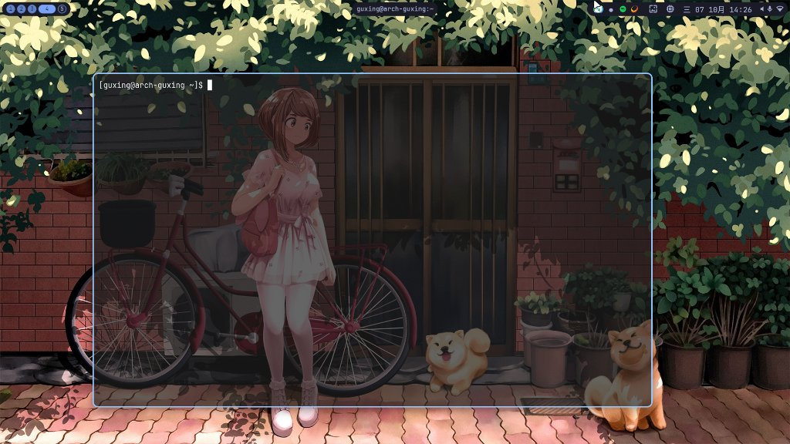

# 我的 niri 桌面

这是我目前在 Arch Linux 上用的 niri 配置。

主要是 niri 搭配 ashell、foot 和 swww，没有用一体化桌面壳。配置和几个小脚本都放在这里，方便自己备份，也方便有兴趣的人拿去参考。

## 预览效果



## 这套配置是什么样的

- **ashell** 放在顶部，显示工作区、窗口标题和托盘，也能换壁纸、打开系统信息。
- **swww** 每 30 分钟随机换一张壁纸，用 1 秒淡入淡出过渡；锁屏期间不换图。
- **hyprlock** 跟随当前壁纸，背景轻微模糊；**hypridle** 在空闲 10 分钟后熄屏。
- **fuzzel** 用来找应用，**mako** 负责通知，中文输入用 **fcitx5**。
- 主修饰键用 **Alt**，niri 版本是 **26.04**。

莫奈取色还没有加，目前先保留这套原生方案。

## 仓库结构

```text
config/
├── niri/config.kdl
├── ashell/config.toml
├── foot/foot.ini
├── fuzzel/fuzzel.ini
├── mako/config
└── hypr/
    ├── hyprlock.conf
    └── hypridle.conf
scripts/
├── niri-wallpaper       # 定时换壁纸
├── niri-wallpaper-next  # 换一张，顶栏按钮也调用它
├── niri-system-info     # 用 foot 打开 top
└── niri-memcheck        # 查看内存和进程 PSS 排行
docs/images/desktop.jpg
```

壁纸、程序二进制、输入法用户数据和运行缓存没有放进来，Sunshine 的账号及配对信息也没有。这里只保存桌面配置和辅助脚本。

## 软件包依赖

- 桌面和顶栏：niri、ashell
- 终端、启动器、通知：foot、fuzzel、mako
- 壁纸：swww（需要 swww-daemon）
- 锁屏和空闲管理：hyprlock、hypridle
- 中文输入和 X11 应用：fcitx5、xwayland-satellite
- 音量与权限提示：PipeWire/WirePlumber（wpctl）、polkit-gnome

字体用 **JetBrainsMono Nerd Font Mono** 和 **Noto Sans CJK SC**，光标是 **Bibata-Modern-Ice**，图标是 **Adwaita**。

几个脚本还需要 bash、util-linux（flock）、procps-ng（top/pgrep）、findutils 和常规 GNU 工具。程序尽量用发行版的包或官方预编译版本，不需要从这个仓库编译。

## 注意事项

1. **壁纸目录**：默认是 `~/图片/壁纸`，图片需要自己准备。脚本会生成 `~/.local/state/niri-wallpaper/current` 链接，锁屏也从这里读取当前壁纸。
2. **中文输入**：fcitx5 的配置和词库没有打包，需要自己设置。


## 快速开始

下面按 **Arch Linux** 来写，用户名不需要和我一样。先装软件，再复制配置；如果已经有自己的配置，记得保留备份。

### 1. 安装依赖

官方仓库里的软件可以先装好：

```bash
sudo pacman -Syu --needed git python niri foot fuzzel mako hyprlock hypridle \
    fcitx5 fcitx5-configtool fcitx5-chinese-addons xwayland-satellite \
    pipewire wireplumber pipewire-pulse polkit-gnome \
    ttf-jetbrains-mono-nerd noto-fonts-cjk adwaita-icon-theme
```

另外需要 **ashell**、**swww**（包括 `swww-daemon`）和 **Bibata-Modern-Ice** 光标。这几个请按可用的软件源或上游安装说明安装，不要把我的第三方源配置直接照搬过去：

- [ashell Releases](https://github.com/MalpenZibo/ashell/releases)：可以用官方预编译版本，安装后要能直接运行 `ashell`。
- [swww](https://codeberg.org/LGFae/swww)：按上游说明安装，或使用提供该软件包的软件源。
- [Bibata Cursor](https://github.com/ful1e5/Bibata_Cursor)：安装包含 Modern Ice 的光标主题。

安装完可以检查一下，所有命令都应该能找到：

```bash
for cmd in niri ashell foot fuzzel mako swww swww-daemon hyprlock hypridle fcitx5 wpctl; do
    command -v "$cmd" || printf '还没装好：%s\n' "$cmd"
done
```

已有其他音频服务的话，先确认是否要切换到 PipeWire；中文输入方案用 `fcitx5-configtool` 自行添加。

### 2. 下载配置、准备壁纸

```bash
git clone https://github.com/mapleLeafOfficial/niri-dotfile.git
cd niri-dotfile
mkdir -p "$HOME/图片/壁纸"
```

把自己的 PNG、JPG 或 WebP 壁纸放进 `~/图片/壁纸`，至少放一张。

### 3. 备份并复制配置

下面的命令会覆盖对应配置。建议在首次登录 niri 之前运行，已经在用 niri 的话也请先保存工作。

```bash
backup="$HOME/.local/state/niri-dotfile-backups/$(date +%Y%m%d-%H%M%S)"
mkdir -p "$backup/config" "$backup/bin" "$HOME/.config" "$HOME/.local/bin"

for name in niri ashell foot fuzzel mako hypr; do
    if [ -e "$HOME/.config/$name" ]; then
        cp -a "$HOME/.config/$name" "$backup/config/"
    fi
done
for name in niri-wallpaper niri-wallpaper-next niri-system-info niri-memcheck; do
    if [ -e "$HOME/.local/bin/$name" ]; then
        cp -a "$HOME/.local/bin/$name" "$backup/bin/"
    fi
done

# 先在临时目录适配路径，不修改下载下来的仓库文件。
stage=$(mktemp -d)
cp -a config scripts "$stage/"
python - "$stage" <<'PY'
import os
import sys
from pathlib import Path

stage = Path(sys.argv[1])
for folder in (stage / "config", stage / "scripts"):
    for path in folder.rglob("*"):
        if path.is_file():
            path.write_text(path.read_text().replace("/home/guxing", os.environ["HOME"]))

# 不把原机器的代理和 NVIDIA 专用变量带到你的机器上。
path = stage / "config/niri/config.kdl"
keys = {
    "http_proxy", "https_proxy", "HTTP_PROXY", "HTTPS_PROXY", "no_proxy", "NO_PROXY",
    "LIBVA_DRIVER_NAME", "NVD_BACKEND", "__GLX_VENDOR_LIBRARY_NAME",
}
lines = path.read_text().splitlines(keepends=True)
path.write_text("".join(line for line in lines if not (line.split() and line.split()[0] in keys)))
PY

cp -a "$stage/config/." "$HOME/.config/"
install -m 755 "$stage"/scripts/* "$HOME/.local/bin/"
rm -rf "$stage"
printf '旧配置备份在：%s\n' "$backup"
```

如果你需要代理或 NVIDIA 专用设置，再按自己的环境加回去；这里默认不沿用我的机器设置。`niri-memcheck` 安装在 `~/.local/bin`，终端里找不到命令时可以直接运行 `~/.local/bin/niri-memcheck`。

### 4. 检查配置，进入桌面

```bash
niri validate -c "$HOME/.config/niri/config.kdl"
```

看到 `config is valid` 后，退出当前桌面，在登录界面选择 **niri** 会话。没有登录管理器的话，可以从本地 TTY 运行 `niri-session`；不要在另一个图形桌面里的终端直接运行它来替代登录步骤。

进入后，按 **Alt+T** 打开终端、**Alt+D** 打开启动器、**Alt+Shift+/** 查看快捷键。壁纸脚本和顶栏会随会话启动。

这套配置不会改 GDM 或 GNOME 的会话设置，但 foot 等应用的配置是用户共享的，在别的桌面里打开同一应用也会读到它们。

## 我常用的快捷键

| 按键 | 做什么 |
| --- | --- |
| Alt+T / Alt+D | 打开终端 / 启动器 |
| Alt+L | 锁屏 |
| Alt+Q | 关窗 |
| Alt+O | 桌面概览 |
| Alt+方向键 | 移动焦点 |
| Alt+Ctrl+方向键 | 搬移窗口或列 |
| Alt+1..9 | 切换工作区 |
| Alt+U / Alt+I | 下一 / 上一工作区 |
| Alt+R | 切换窗口宽度 |
| Alt+V | 切换浮动 |
| Alt+X | 切换当前窗口的规则透明度，不是全局开关 |
| Print | 截图 |
| Alt+Shift+/ | 打开快捷键速查 |


## 壁纸来源

预览图里的壁纸来自 [Wallhaven](https://wallhaven.cc/w/mdozo8)。

## 参考文献

- [niri 动画配置](https://github.com/niri-wm/niri/wiki/Configuration:-Animations)
- [niri 窗口规则](https://github.com/niri-wm/niri/wiki/Configuration:-Window-Rules)
- [Apple SwiftUI Spring](https://developer.apple.com/documentation/swiftui/animation/spring(response:dampingfraction:blendduration:))
